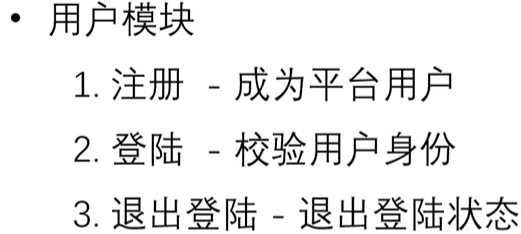

云笔记项目

#  - 配置




 

1. 创建项目	django-admin startproject tedu_note
2. 创建应用        python manage.py startapp user  【注意 python3 没有效果】
3. 创建数据库tedu_note


4. 配置settings.py


5. 启动项目 	python manage.py runserver   【注意  python3 manage.py runserver没有效果】


# 1. 注册

1. 创建用户表

```python
class User(models.Model):
    username = models.CharField(verbose_name="用户名",max_length=30,unique=True)

    password = models.CharField('密码',max_length=32)

    created_time = models.DateTimeField('创建时间',auto_now_add = True) # 第一次被创建时自动设置为当前日期和时间

    updated_time = models.DateTimeField('更新时间',auto_now = True) # 在模型的任何 save() 操作时自动设置为当前日期和时间

    def __str__(self):
        return 'username %s' % (self.username)
```

- 同步到数据库

> python manage.py makemigrations

> python manage.py migrate


##  1.用户注册


```python
# views.py文件中的视图函数
def reg_view(request):
    #注册
    if request.method == 'GET':
        # GET 返回页面
        return render(request,'user/register.html')
    elif request.method == 'POST':
        username = request.POST['username']
        pass1 = request.POST['password_1']
        pass2 = request.POST['password_2']


        # POST 处理提交数据

        #  1. 密码一致
        if pass1 != pass2:
            return HttpResponse('两次输入密码不一致！！！')
        #  2.当前用户名是否可用  检查是否注册
        old_user = User.objects.filter(username=username)
        if old_user:
            return HttpResponse('用户名已注册！！！')
        # 插入数据 【明文处理】
        User.objects.create(username=username,password = pass1)
        return HttpResponse('注册成功！')
```


- 上述代码问题

​	密码如何处理？
​	插入问题
​	产品经理要求注册则免登陆一天，这功能怎么做

###   密码 --哈希

- 代码

```py
def reg_view(request):
    #注册
    if request.method == 'GET':
        # GET 返回页面
        return render(request,'user/register.html')
    elif request.method == 'POST':
        username = request.POST['username']
        pass1 = request.POST['password_1']
        pass2 = request.POST['password_2']

        # POST 处理提交数据
        #  1. 密码一致
        if pass1 != pass2:
            return HttpResponse('两次输入密码不一致！！！')

        # 哈希算法 - 给定明文  计算出一段定长的  不可逆的值  md5  sha-256
        # 特点
        # 1. 定长输出 ： 不管明文输入长度多少  哈希值定长  md5 - 32位 16进制  【解释密码设置32】
        # 2. 不可逆 ：无法反向计算出 对应 的 明文
        # 3. 雪崩效应 输入改变 输出改变
        # 场景 ： 1.密码处理    2.文件的完整性校验
        # 如何使用 方法调用
        m = hashlib.md5()
        m.update(pass1.encode())  # encode()变成字节串
        pass1_hash = m.hexdigest()  # 生成哈希值

        #  2.当前用户名是否可用  检查是否注册
        old_user = User.objects.filter(username=username)
        if old_user:
            return HttpResponse('用户名已注册！！！')
        # 插入数据 【明文处理】
        User.objects.create(username=username,password=pass1_hash)
        return HttpResponse('注册成功！')
```


###  唯一索引引发的重复问题  try


- 解决

```py
try :
    User.objects.create(username=username,password=pass1_hash)
except Exception as e:
    # 由于唯一索引 报错 重复插入 【唯一索引注意并发写入问题】
    print('--create user error %s' % (e))
    return HttpResponse('用户名已注册')
```

> 请求量大 User.objects.create 会报错 在username该字段 因为是唯一字段  可能由于并发注册问题 发生重复写入问题  d对于这类问题 善于用try解决

#### 补充 ：哈希

```pyth
import hashlib
m = hashlib.md5()
m.update(b'明文')  # 必须字节b串
m.hexdigest()  # hexdigest 理解为16紧进制摘要


# 若要想要计算新的数值
# 从新这样生成
m = hashlib.md5()
m.update(b'明文')  # 必须字节b串
m.hexdigest()  # hexdigest 理解为16紧进制摘要

# 若是直接update  相当于两次明文的拼接 
```


### 免登录seesion

```py
# 免登录一天 session  用户名  主键  存入 session
request.POST['username'] = username
request.POST['uid'] = user.id
# TODO 修改session存储时间为1天   settings.py
```

##  2. 用户登录


- 代码

```py
def login_view(request):
    if request.method == 'GET':
        # GET 返回页面
        return render(request,'user/login.html')
    elif request.method == 'POST':
        # 获得数据
        username = request.POST['username']
        password = request.POST['password']

        # 查询  是否有此人
        # username 是唯一索引
        try:
            user = User.objects.get(username=username) # 找不到 肯定没有
        except Exception as e:
            print('--login user error %s' % (e))
            return HttpResponse('用户名或者密码错误！！！')

        # 比对密码  因为哈希不可逆 所以从新生成哈希  用哈希数值进行比对
        m = hashlib.md5()
        m.update(password.encode())
        if m.hexdigest() != user.password:
            return HttpResponse('用户名或密码错误')

        # 记录会话状态
        # 免登录一天 session  用户名  主键  存入 session
        request.POST['username'] = username
        request.POST['uid'] = user.id

        return HttpResponse('登录成功！！！')
```


###  会话状态时间  + cookie


1. 记住用户名  免登录三天

- 测试登录

```py
# 判断有没有✔  通过检查浏览器响应分析 checkbox的状态 remember=on
# #点选了->Cookies存储username,uid时间3天
resp = HttpResponse('--------success---------')
if 'remember' in request.POST:
    resp.set_cookie('username', username, 3600 * 24 * 3)
    resp.set_cookie('uid', user.id, 3600 * 24 * 3)

return resp
```


1. 不记住    一天  就是session


### 用户登录状态校验


# 3. 网站首页


#  4. 退出登录


#  5. 笔记模块  列表页


###  添加笔记


